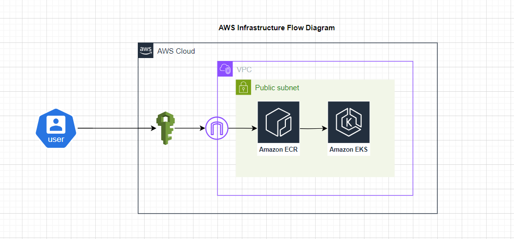

# AWS Infrastructure for Assesment

AWS Flow Diagram

This flow diagram is designed to create AWS Infrastructure for deploying Microservices. We are using serveral AWS services that will give us scalable and robust environment for our services.

**IAM -** IAM provides us access control on our AWS Infra so no one other than authorized user can access and modify our infrastructure.

**Amazom ECR** - It is fully managed Docker container registry that will allow us to store, manage and deploy container images.

**Amazon EKS** - It is AWS managed Kubernetes service to run kubernetes cluster on AWS cloud. We will run our containers on EKS cluster.

**Approach behind this solution**

This AWS Infrastructure Flow is for deploying a microservice application using Amazon Elastic Container Registry (ECR) and Amazon Elastic Kubernetes Service (EKS). This represents a robust and scalable way to deploy a microservice application using modern DevOps practices. By using managed services like ECR and EKS, organizations can reduce operational complexity, improve security, and focus more on development.

1. **Infrastructure Scalability** : Both Amazon ECR and EKS are designed to scale with your application. EKS can automatically scale the number of pods based on demand, and ECR can handle a large number of image pulls and pushes.
2. **AWS Managed Services** : Using managed services like EKS and ECR reduces the operational overhead. AWS handles the management of the underlying infrastructure, allowing developers to focus on application development and deployment.
3. **Security** : VPC provides network isolation. AWS credentials ensure secure access to resources, and IAM policies can enforce strict access controls. ECR integrates with IAM to control access to your repositories and images
4. **Integration** : This approach integrates seamlessly with other AWS services and CI/CD tools, enabling a smooth and automated deployment pipeline.
5. **Reliability** : AWS provides high availability and reliability for its services, ensuring that your application remains accessible and performant.
