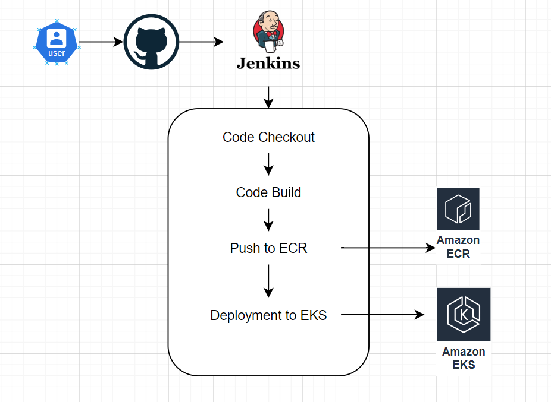

# Automation pipeline

This is a automation pipeline to deploy Java application to EKS cluster through ECR. In this we are creating a jenkins pipeline to checkout, build, test code and then push the latest image to ECR repo from that repo our EKS will pull the image and run on cluster.

**CICD Flow Diagram**

This diagram demonstrate the basic flow of our CICD pipeline to deploy the application in an automated way.

**Approach**

This CI/CD approach leverages Jenkins to automate the process of building, pushing, and deploying a Java application. After the user commits code to GitHub, Jenkins triggers the pipeline, performing code checkout, building the application, and creating a Docker image. This image is then pushed to Amazon ECR. Finally, the pipeline deploys the Docker image to an Amazon EKS cluster, ensuring the application is updated and running with the latest changes. This streamlined workflow enhances development efficiency, reduces manual intervention, and ensures continuous deployment to the Kubernetes environment

* **Automation and Efficiency** : The entire pipeline, from code commit to deployment, is automated using Jenkins. This reduces manual intervention, minimizes human error, and speeds up the deployment process.
* **Integration with GitHub** : Direct integration with GitHub ensures that every code commit can trigger the pipeline. This promotes continuous integration, where code changes are frequently merged and tested, leading to early detection of issues.
* **Scalability and Flexibility** : Using Amazon ECR for Docker image storage and Amazon EKS for deployment allows for scalable and flexible application management. EKS can handle large-scale deployments and ensures that the application can scale according to demand.
* **Security** : AWS services like ECR and EKS are integrated with IAM for fine-grained access control, ensuring that only authorized users and processes can access and deploy the application. This enhances the overall security of the deployment pipeline.
