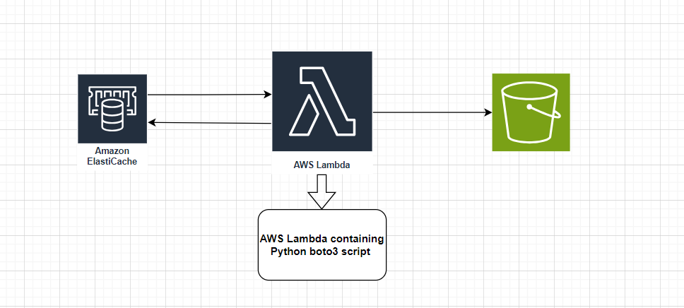
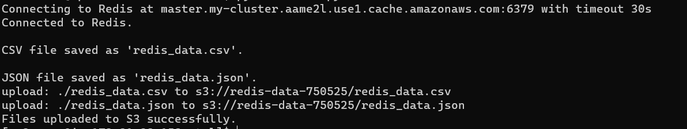
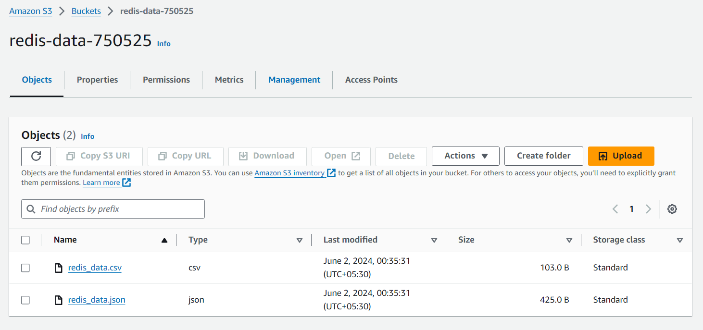

## Python script for fetching AWS ElastiCache Redis dumps

This a python boto3 code to fetching AWS Elasticache data and store it in S3 Bucket.

**Approach**

The apporach we are following is first we need to have a AWS ElastiCache cluster and a S3 bucket. By using boto3 python SDK we are first connecting to Redis cluster and fetching all the data. After that we are converting that data into csv and json format as per the requirement. Now we are creating a s3 client using boto3 and then using boto APIs we are storint these data int s3 bucket.

## Output of the Python Code

## S3 bucket screenshot with files

## Deployment strategies

Terraform - We can use terraform to create AWS infrastructure and deploy this code on AWS Lamnda Functions in .zip format.

CI/CD - We can create a GitHub Action pipeline that will intigrate with AWS and upload this code to AWS Lambda function with all dependencies.

Manual deployment - We can also deploy this package as a zip directly from AWS console.
